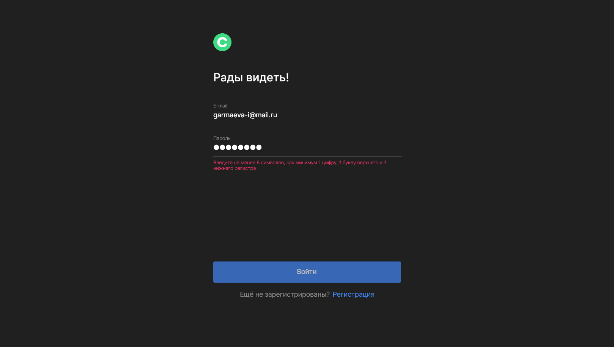
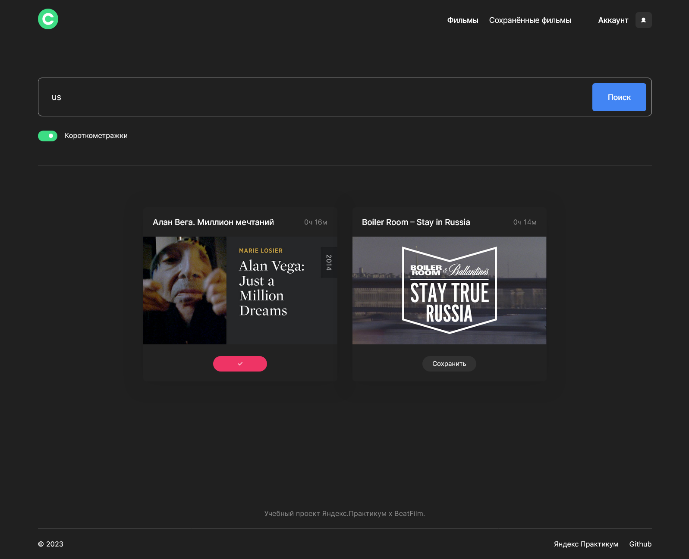

# Movies Explorer App from [Yandex Practicum](https://practicum.yandex.ru/) Web-developer course.

Frontend part for the `Movies Explorer App`. This app is a full-stack interactive SPA where users can search for movies by keywords and add them to favorites in their personal account.

## Links

Deploy: [https://movies.irina.nomoredomainsicu.ru](https://movies.irina.nomoredomainsicu.ru)  
Backend repository: [https://github.com/IrinaGarmaeva/movies-explorer-api](https://github.com/IrinaGarmaeva/movies-explorer-api)  

## Functionality

* User registration and authorization
* Editing user data
* Validation user data
* Searching movies by keyword and duration
* Adding movies to favorites

## Technologies
* HTML5
* BEM
* CSS
* Flexbox
* GRID
* React JS (Functional components, hooks)
* Webpack

## Screenshots

<b>Show all</b>

Main page

Registration page

Sign in page

Movies page

Search short movies

No results on search by keywords

Saved movies page

Profile page

Successfull result on edit profile page

Mobile menu on movies page

Mobile menu on main page

Not found page

## Description

### Overview
The project comprises a main page that provides information about the current project and all previous projects completed during the 10-month duration of the educational program. Utilizing the latest React Router techniques, users can seamlessly navigate to various pages within the site.

### User Authentication
To access all available features and navigate to other pages, users must first log in if they have already registered or create an account if they are new to the app. Also there is live user data validation.

### Movies Page
The Movies page displays a collection of movies, along with their relevant information, such as title and duration. This data is fetched from the server via request-response mechanisms, with the server forming the backend component, which was developed in the initial phase of this project. Movies are dynamically displayed on the page upon successful retrieval, facilitated by RESTful API calls.

### Saving Movies
Users have the option to add movies to their list of favorite films by clicking the "Save" button. The "Saved Movies" page, one of the key features of the website, allows users to access their list of favorite movies. Users can further manage their list by removing movies through the use of the "X" symbol button.

### Profile Management
Lastly, the application includes a Profile page where users can customize their username and email settings to suit their preferences.

## How to install and run locally

Clone repository:

  `git clone https://github.com/IrinaGarmaeva/movies-explorer-frontend`

Install dependencies:

  `npm install`

Run app:

  `npm run start`

Build app(production):

  `npm run build`

## Figma design:

- [Layout: Dark-4 ](https://www.figma.com/file/6FMWkB94wE7KTkcCgUXtnC/light-1?type=design&node-id=891-3857&mode=design&t=2o1n0jVrlmCiWxAF-0)
